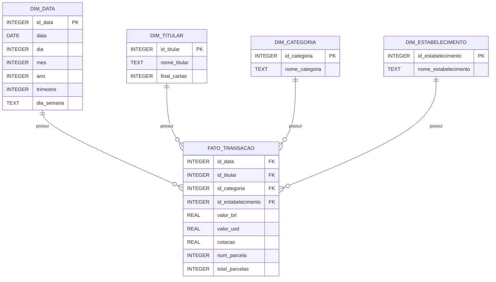

Plano do Projeto

Objetivo: Construir um ecossistema de Business Intelligence para análise de gastos de cartões de crédito, utilizando dados de 12 meses de faturas.

Fases de Execução:

Mapeamento de Dados: Análise de 12 arquivos CSV com estrutura de faturas bancárias.

Modelagem Dimensional: Criação de um esquema em estrela (Star Schema) para otimizar a performance analítica.

Desenvolvimento do Pipeline ETL: * Extração: Leitura automatizada via Python e Pandas.

Transformação: Limpeza de campos nulos, padronização de tipos de dados (Datas e Floats) e decomposição de parcelas (ex: "2/10").

Carga: Ingestão para PostgreSQL com orquestração de chaves substitutas (IDs).

Análise e Validação: Execução de consultas SQL para responder métricas de negócio (Gasto por titular, categoria e tempo).

Arquitetura do Data Warehouse

Modelo: Star Schema (Esquema em Estrela)

Tabela Fato (fato_transacao): Armazena os eventos quantitativos (valor em R$, valor em US$, cotação e número da parcela) e as chaves estrangeiras (FKs).

Dimensões:

dim_data: Atributos temporais (dia, mês, ano, trimestre).

dim_titular: Nome do dono do cartão e final do cartão.

dim_categoria: Classificações de despesas (ex: Restaurante, Saúde).

dim_estabelecimento: Descrição do local da transação.

Dicionário de Dados

Este documento descreve a estrutura do seu Data Warehouse para garantir a clareza do modelo:

Como Executar

Crie o banco de dados no PostgreSQL e execute o script `setup_dw.sql`.
Instale as dependências: `pip install pandas sqlalchemy psycopg2`.
Coloque os CSVs na pasta `/dados`.
Execute o script: `python etl.py`.

Resultados do banco de dados:

Perguntas de Negócio:

(Star Schema)

